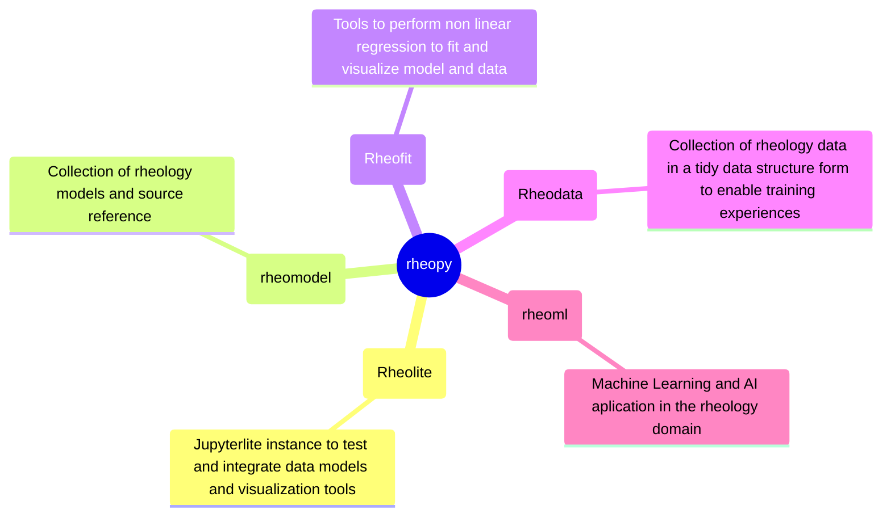

# Rheolite Demo

static HTML site at https://rheopy.github.io/rheolite/lab/index.html

# Rheology playground

In this playground we collect a set of notebook and test data to share analysys workflow through pyodyde executable notebook. The user can run the notebook directly on jupyterlite!

The example notebooks can be used as training material directly in the jupyterlite environment. Each user will access the static HTML site and perform the analysis in the browser.

The user can also modify the notebooks in the familiar jupyterlab environment, upload and analyze custom data. In case some of the output of the analysis is of interest can be easyly saved in the jupyterlite filesystem and downloaded locally.

The experience is the same across OS, no requirement to install anything, it should work on mobile devices too.

