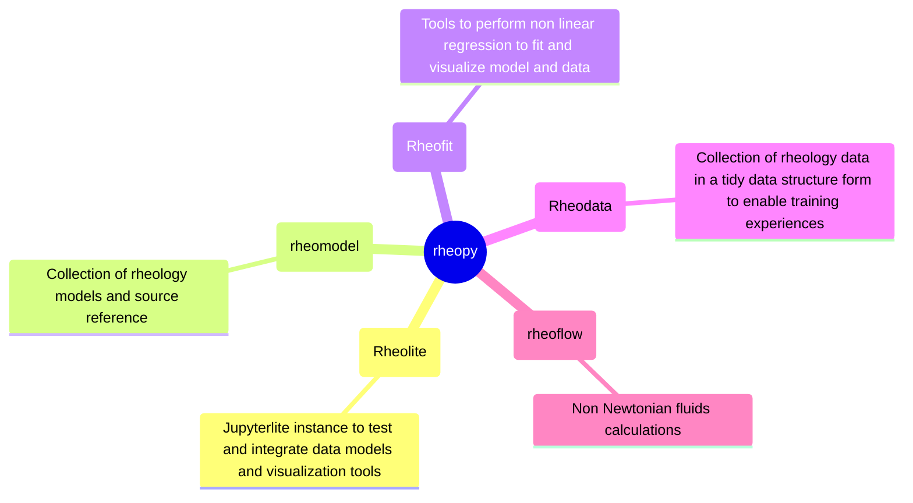

# Rheolite Demo

static HTML site at https://rheopy.github.io/rheolite/lab/index.html

## Local development

Install [uv](https://docs.astral.sh/uv/) and Python 3.12. From the repository root,
sync the locked JupyterLite and JupyterLab environment, then open the notebooks:

```powershell
uv sync --locked
uv run jupyter lab content
```

Notebook-specific analysis packages are installed by the notebooks when needed;
they are not part of the base `uv sync` environment.

To build and preview the static JupyterLite site locally:

```powershell
uv run jupyter lite build --contents content --output-dir dist
uv run python -m http.server 8000 --directory dist
```

Open <http://localhost:8000/lab/index.html> in a browser and press `Ctrl+C` to stop
the preview server. The GitHub Pages workflow uses the committed `uv.lock` and
builds the notebooks in `content/` on pushes to `main`.

# Rheology playground


In this playground we collect a set of notebook and test data to share analysys workflow through pyodyde executable notebook. The user can run the notebook directly on jupyterlite!

The example notebooks can be used as training material directly in the jupyterlite environment. Each user will access the static HTML site and perform the analysis in the browser.

The user can also modify the notebooks in the familiar jupyterlab environment, upload and analyze custom data. In case some of the output of the analysis is of interest can be easyly saved in the jupyterlite filesystem and downloaded locally.

The experience is the same across OS, no requirement to install anything, it should work on mobile devices too.



```mermaid
mindmap
  root((rheopy))
    (Rheolite)
      Jupyterlite instance to test and integrate data models and visualization tools
    (rheomodel)
      Collection of rheology models and source reference 
    (Rheofit)
      Tools to perform non linear regression to fit and visualize model and data
    (Rheodata)
      Collection of rheology data in a tidy data structure form to enable training experiences
    (rheoflow)
      Non Newtonian fluids calculations
```
